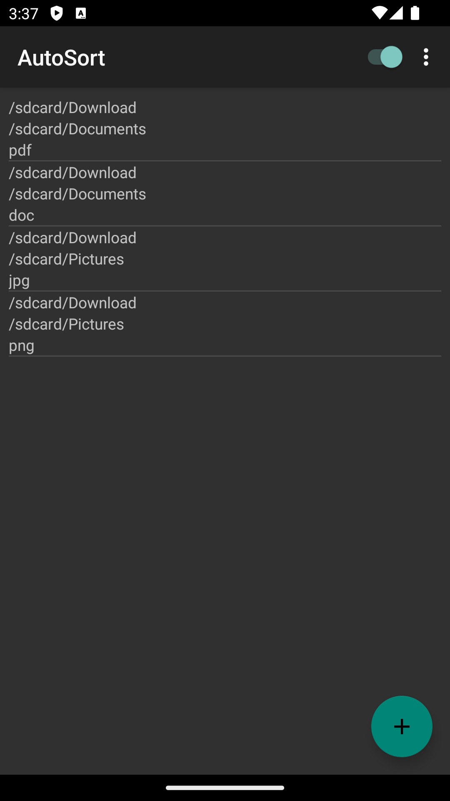
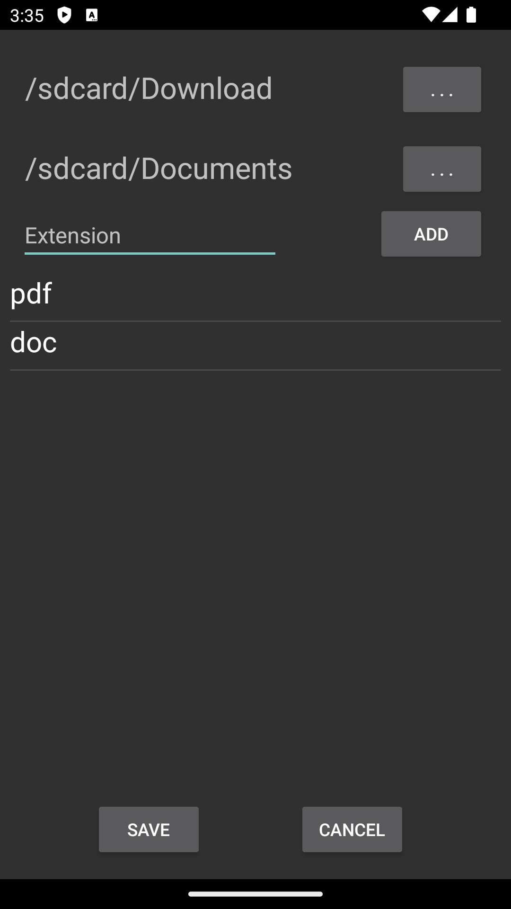
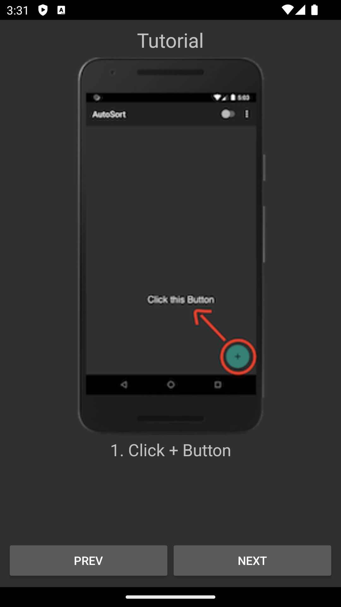

# AutoSort

 

> An android app for categorization files by extension

## Preview

  <table>
    <tr align="center">
      <th>Main Screen</th>
      <th>Add Sorter</th>
      <th>Tutorial</th>
    </tr>
    <tr align="center">
      <td></td>
      <td></td>
      <td></td>
    </tr>
  </table>

## Features

- Categorization files by extension
- Monitoring directory and execute automatically
